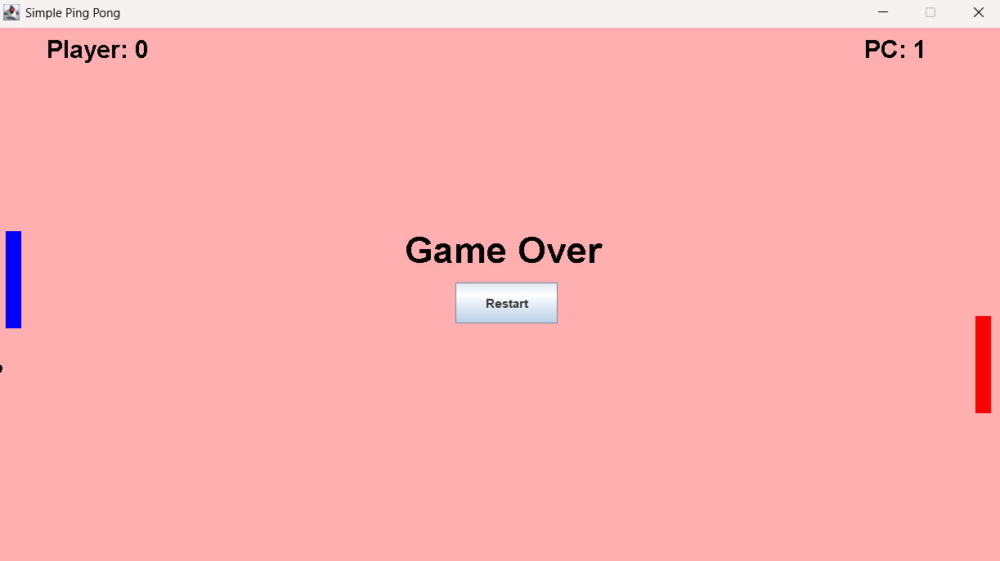
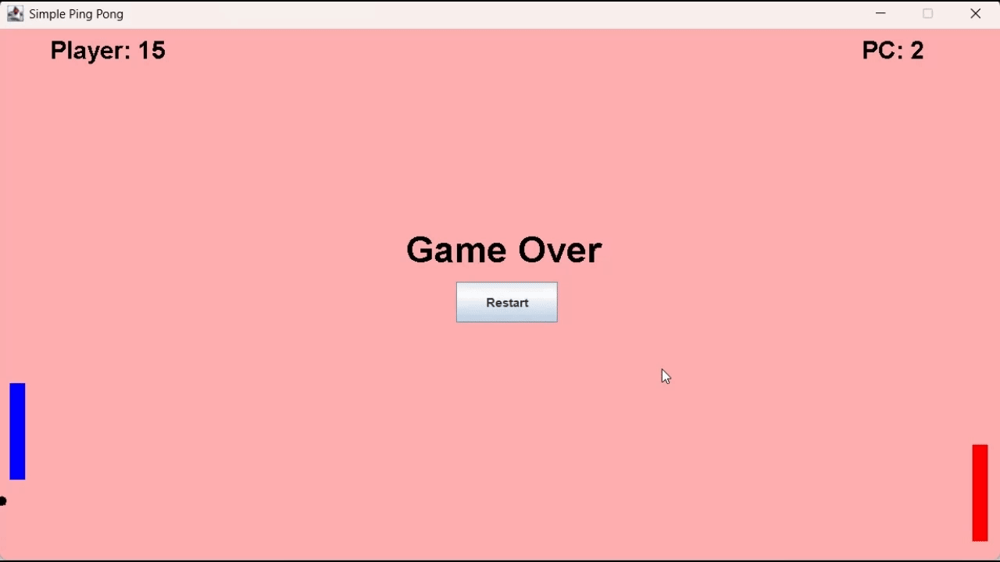

# Ping-Pong (Work in Progress)
Ping Pong IDE Game (Player vs Computer)

## Steps to run this locally:
1. Download this project as a ZIP.
2. Extract the project and then import it as a Java Project into your Java IDE.
3. Run the project as a Java Application.

### Game Instructions:
1. You control the left hand side blue paddle board with the keys 'W' and 'S' on your keyboard.
2. The game ends when you miss the bouncing ball.

## Screenshot

## Game Play

### Possible glitches
- If the ball goes behind the player's paddle it may result in an exponential increase of the score recorded due to the game mechanics being based on collision.

### References
1. Helpful video guide: https://youtu.be/MPJ8XRpZZCk
